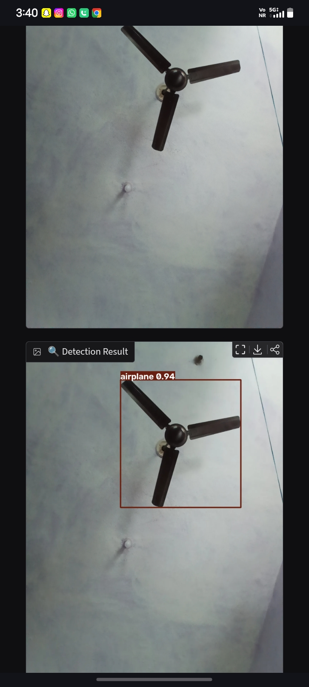

# 🤖 AI Object Detection System

An AI-based object detection system built using Python, YOLO and Gradio.

## 🚀 Features

- Detect objects in images
- Real-time camera detection
- Count detected objects
- Display confidence scores
- User-friendly web interface

## 🛠️ Technologies Used

- Python
- YOLO
- Ultralytics
- OpenCV
- Gradio
- Google Colab

## 📌 How It Works

1. Upload an image or use the camera.
2. YOLO detects objects.
3. The system identifies each object.
4. Objects are counted.
5. Confidence scores are displayed.

## 🎯 Project Goal

The goal of this project is to demonstrate how Artificial Intelligence and Computer Vision can be used for automatic object detection.

## 👩‍💻 Author

Taniya Yadav  
B.Tech CSE
## 📸 Project Demo

